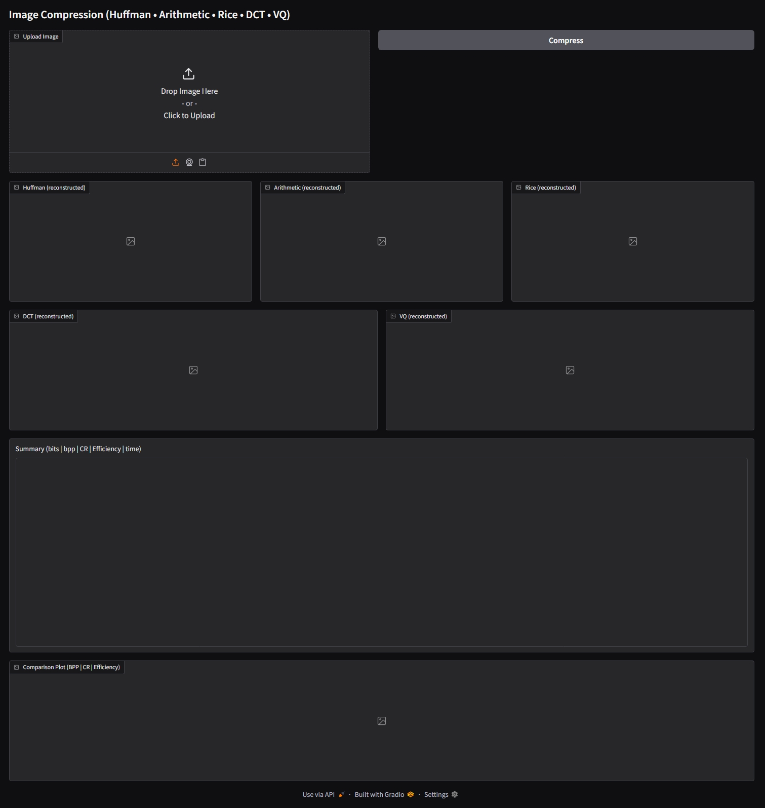
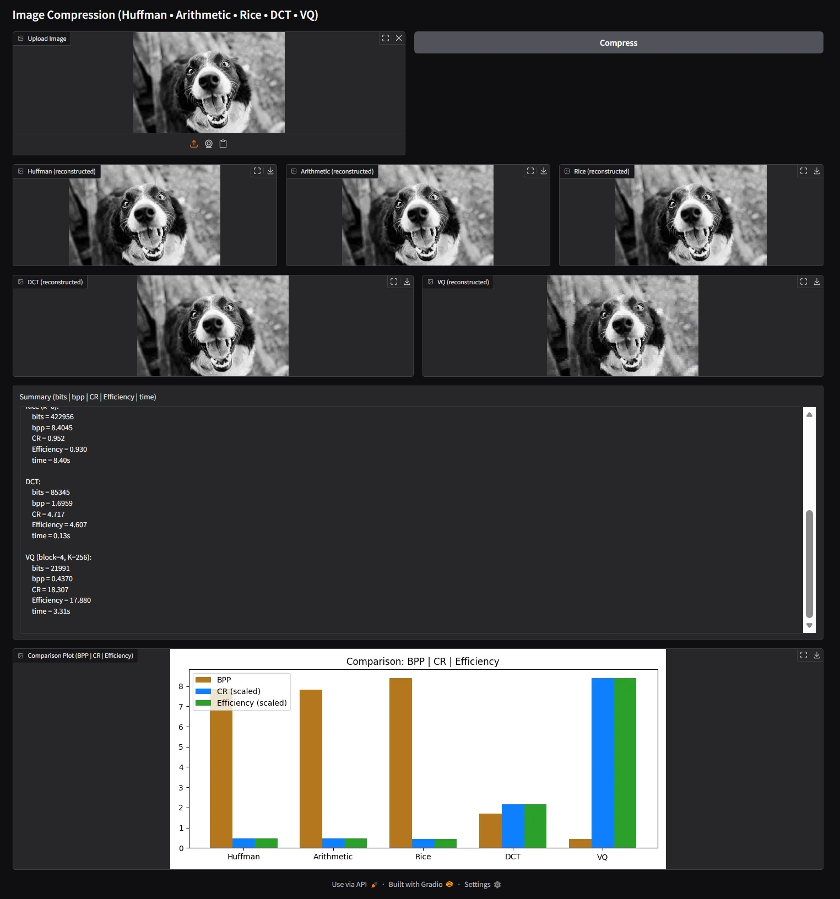
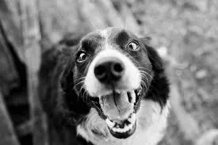

<h1 align="center">Image Compression</h1>

<p align="center">
  A unified image compression system combining <b>entropy</b>, <b>transform</b>, and <b>vector quantization</b> techniques  
  <br>Supports Huffman, Arithmetic, Rice, DCT, and VQ compression — fully automatic, CPU-friendly implementation.
</p>

<p align="center">
  
  
  
  
</p>

---

## **Introduction**

This project implements a **complete image compression suite** featuring five classical and modern techniques:

### 🔹 **Entropy Coders**
- Huffman Coding  
- Arithmetic Coding  
- Rice Coding (auto-k)

### 🔹 **Transform Coder**
- Block DCT + Quantization + Huffman

### 🔹 **Vector Quantization**
- LBG (k-means) Codebook + Huffman

A full **Gradio Web App** allows users to upload an image and automatically:

✔ Compress using all 5 methods  
✔ Reconstruct images  
✔ Compare BPP, Compression Ratio, and Efficiency  
✔ View all reconstructions side-by-side  
✔ See a unified comparison graph  
✔ No manual parameter selection required  

---

## **Theory of Methods**

### 1. Huffman Coding (Entropy)
- Prefix-free  
- Optimal integer-bit coder  
- Builds binary tree from symbol frequencies  

### 2. Arithmetic Coding
- Encodes entire sequence into an interval  
- Bit-efficient, near entropy  
- Uses integer renormalization  

### 3. Rice Coding
- Unary quotient + binary remainder  
- Best for smooth images and residuals  
- Auto-selects **k = 0–8**

### 4. DCT Compression
- Block-wise DCT  
- Quantization  
- Huffman coding on coefficients  
- Lossy (JPEG-style)

### 5. Vector Quantization (VQ)
- Codebook via k-means (LBG)  
- Blocks replaced with nearest centroid index  
- Indices Huffman coded  
- Lossy  

---

## **Project Structure**

```

Image-Compression/
│
src/
│
├── __pycache__/            # Python bytecode cache
├── .gradio/                # Gradio session & cache files
│
├── arithmetic.py           # Arithmetic coding (encode/decode)
├── dct.py                  # DCT blocks, quantization, Huffman wrapper
├── huffman.py              # Huffman tree, codes, encoding & decoding
├── rice.py                 # Rice (Golomb–Rice) encoding & decoding
├── vq.py                   # Vector Quantization (LBG/k-means, encoding & decoding)
│
└── main.py                 # Full pipeline + Gradio front-end UI
|
├── assets/
│   ├── output_screen.jpg
│   ├── images_output.jpg
│   ├── dog_input.png
│   ├── Huffman.png
│   ├── Arithmetic.png
│   ├── rice.png
│   ├── dct.png
│   ├── vq.png
│   ├── comparison_graph.png
│
└── README.md

````

---

## **Installation**

```bash
python -m venv venv
venv\Scripts\activate   # Windows
pip install numpy opencv-python matplotlib gradio bitarray
````

---

## **Run the App**

```bash
cd src
python main.py
```

Open browser:

```
http://127.0.0.1:7860
```

---

## **Gradio Web Interface**

### Interface Screenshot




### Program Output Window




---

### **Input Image**


---

### **Reconstructed Outputs**

Huffman
<br>
Arithmetic
<br>
Rice
<br>
DCT
<br>
VQ


---

## **Results: Size Comparison**

Input image size: **54 KB**

| Method     | Preview Size (KB) | CR (Preview) |
| ---------- | ----------------- | ------------ |
| Huffman    | 7                 | 7.71×        |
| Arithmetic | 7                 | 7.71×        |
| Rice       | 7                 | 7.71×        |
| DCT        | 7                 | 7.71×        |
| VQ         | 6                 | 9.00×        |

> ⚠️ Note: These are WebP preview sizes displayed by Gradio, not raw-compressed bitstreams.

---

# **Pseudocode (Main Pipeline)**

```text
function COMPRESS_AND_SHOW_ALL(image):
    gray = preprocess(image)
    pixels = flatten(gray)
    compute entropy and original_bits

    run: Huffman, Arithmetic, Rice, DCT, VQ
    for each method:
        compute Bits, BPP, CR, Efficiency
        store reconstructed image

    plot = generate_comparison_graph()
    return summary, reconstructions, plot
```

---

## **Summary**

* Entropy methods are **lossless**
* DCT & VQ provide **lossy** comparison
* Arithmetic achieves best entropy compression
* VQ gave smallest preview size (6 KB)
* PNG still outperforms classical methods

---

## **Limitations**

* Grayscale-only
* WebP preview affects visual file sizes
* Arithmetic is CPU-heavy
* DCT/VQ parameters fixed

---

## **Future Work**

* Add predictive coding (JPEG-LS style)
* Add Golomb-Rice residual coding
* Support RGB (YCbCr transform)
* Add LZ77 backend
* Export actual bitstreams
* Compute PSNR/SSIM

---

## Author

**Jeevan V Gowda**<br>
M.Tech – Signal Processing and Machine Learning<br>
National Institute of Technology, Karnataka<br>
[](https://www.linkedin.com/in/jvg-jeevan)  
---
## License


This project is licensed under the **MIT License**.
---

